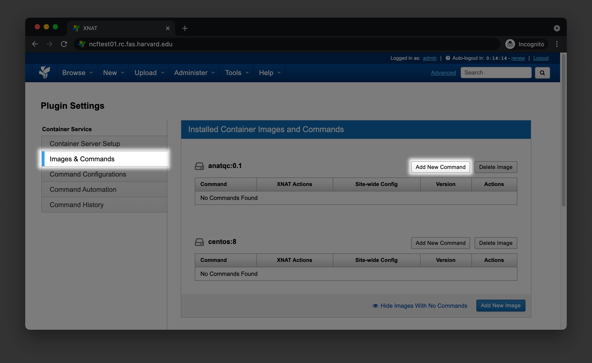
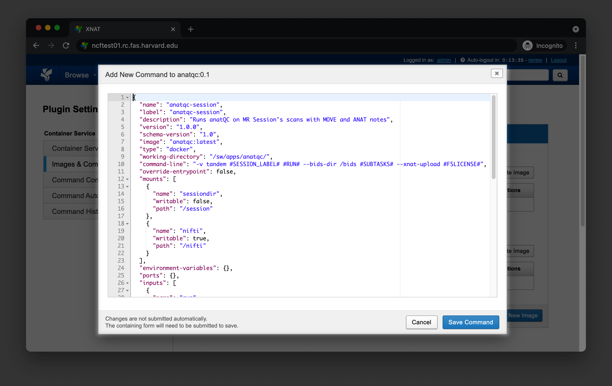
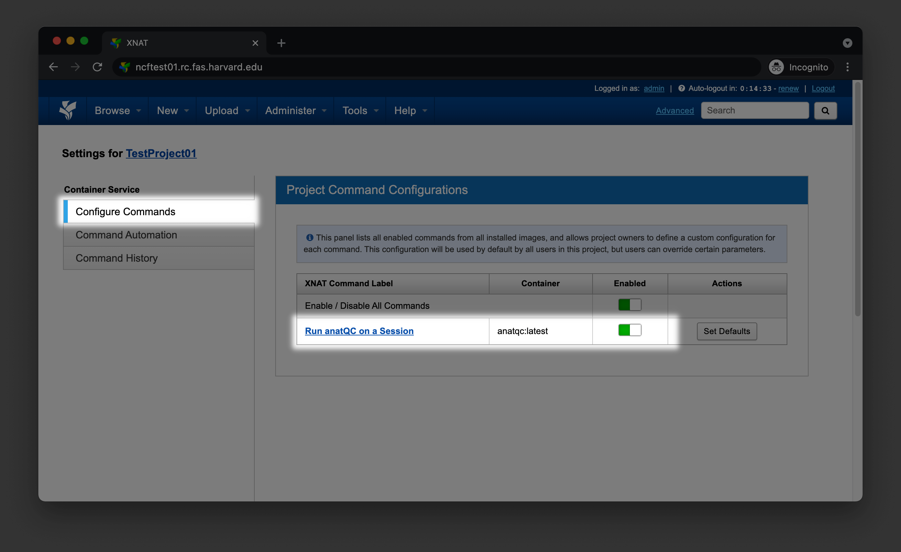

# Administration Guide

## Installation

!!! warning "Recommendation"
    Unless you have a strong reason to build the container yourself, it is
    recommended that you download one of the prebuilt containers.

You can install AnatQC either by downloading one of the [prebuilt 
containers][Container download], or by [building the container][Container build]
manually.

### Downloading the container
There are prebuilt versions of AnatQC hosted on [GitHub Container Registry][GHCR]. 
You can pull any specific version of AnatQC by running the following command

```bash
docker pull ghcr.io/harvard-nrg/anatqc:0.6.0
```

If you are using [Apptainer/Singularity][], use the following command instead

```bash
singularity build anatqc.sif docker://ghcr.io/harvard-nrg/anatqc:0.6.0
```

### Building the container
To build AnatQC as a container, grab the latest `Dockerfile` from the [AnatQC
Repository][Repository] and run the following command

```bash
docker build -t anatqc:latest - < Dockerfile
```

After building the container, you should be able to execute AnatQC with 
docker

```bash
docker run anatqc:latest --help
```

## XNAT Integration
The following section will describe how to integrate AnatQC into your [XNAT][]
installation by building, installing, and configuring the plugin.

### Building the plugin
Clone the `xnat-1.8` branch from the [AnatQC repository][Repository]

```bash
git clone -b xnat-1.8 --single-branch https://github.com/harvard-nrg/anatqc
```

[XNAT][] plugins are built using [Gradle][]. Change your working directory into 
the repository directory, and compile the plugin

```bash
cd anatqc
./gradlew jar
```

Once the plugin has been successfully compiled, move the resulting `.jar` into 
your [XNAT][] plugins directory

```bash
mv ./build/libs/anatqc-plugin-1.0.0.jar ${XNAT_HOME}/plugins/
```

### Setting up the container
!!! note "Important note"
    Following this documentation section assumes you have successfully 
    [downloaded][Container download] one of the prebuilt container images,
    or you have [built][Container build] the container image manually, and 
    you have the container image available within a local Docker daemon 
    e.g., `unix:///var/run/docker.sock` running on your XNAT server.

To setup the container within [XNAT][], go to `Administer > Plugin Settings >
Images & Commands`, find the AnatQC container, and click `Add New Command`



You should see a dialog box where you can configure your command. 
Paste the contents from [command.json][]



Now, navigate to your Project home page and click on `Project Settings` in
the `Actions` box. Select `Configure Commands` and enable the new command for
your project



You are now ready to [run the AnatQC pipline][Run AnatQC] from the XNAT user
interface!

[command.json]: https://github.com/harvard-nrg/anatqc/blob/xnat-1.8/command.json
[Apptainer/Singularity]: https://apptainer.org/
[GHCR]: https://ghcr.io/harvard-nrg/anatqc
[Container download]: #downloading-the-container
[Container build]: #building-the-container
[XNAT]: https://www.xnat.org
[Gradle]: https://gradle.org/install/
[Run AnatQC]: /user/#running-the-pipeline
[Repository]: https://github.com/harvard-nrg/anatqc
