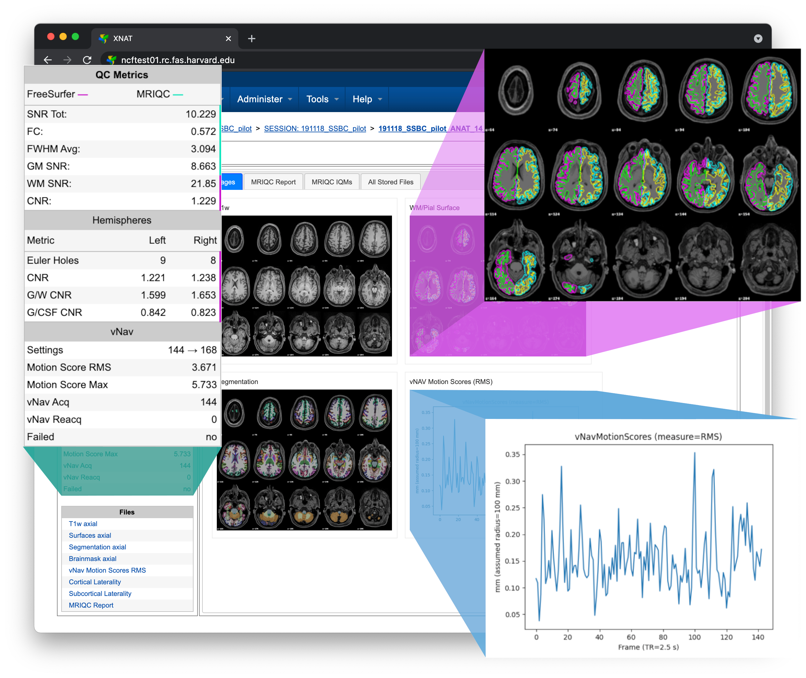

# Welcome to AnatQC!

AnatQC is a high-resolution "anatomical" MRI quality control pipeline built on
the excellent [FreeSurfer][], [MRIQC][], and [volumetric navigators][vNav] 
software packages.

Working closely with neuroimaging experts, we developed a comprehensive quality
control pipeline and user interface for the [XNAT][] informatics and data 
management platform. AnatQC allows neuroimaging researchers to quickly assess 
image quality, and use those insights to respond to data acquisition issues.

Please refer to the main menu for detailed documentation!

[FreeSurfer]: https://doi.org/10.1016/j.neuroimage.2012.01.021
[MRIQC]: https://doi.org/10.1371/journal.pone.0184661
[vNav]: https://github.com/MRIMotionCorrection/parse_vNav_Motion
[XNAT]: https://www.xnat.org
