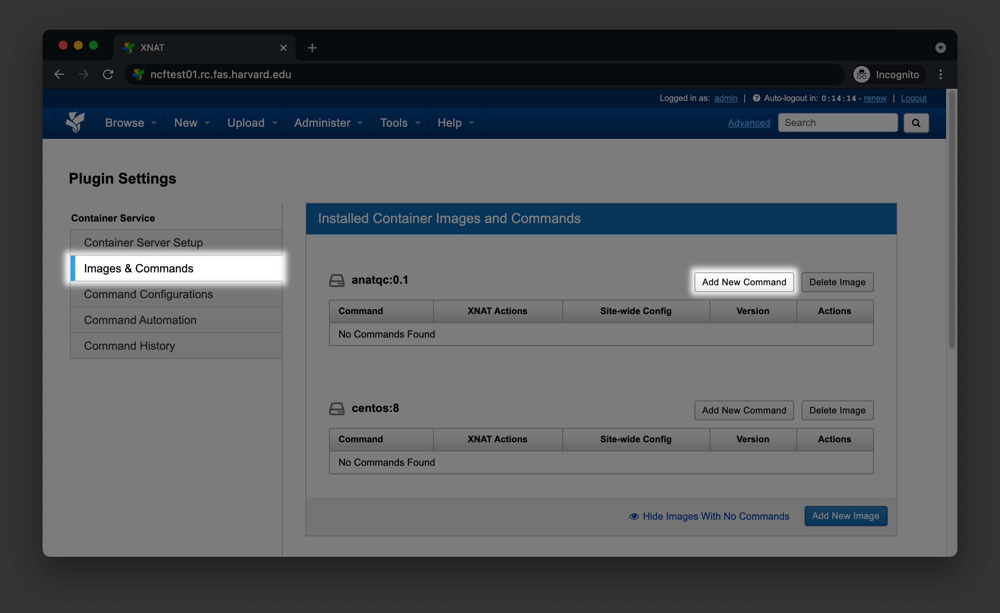
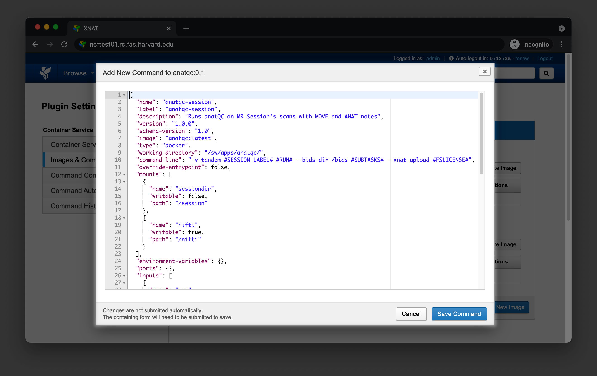
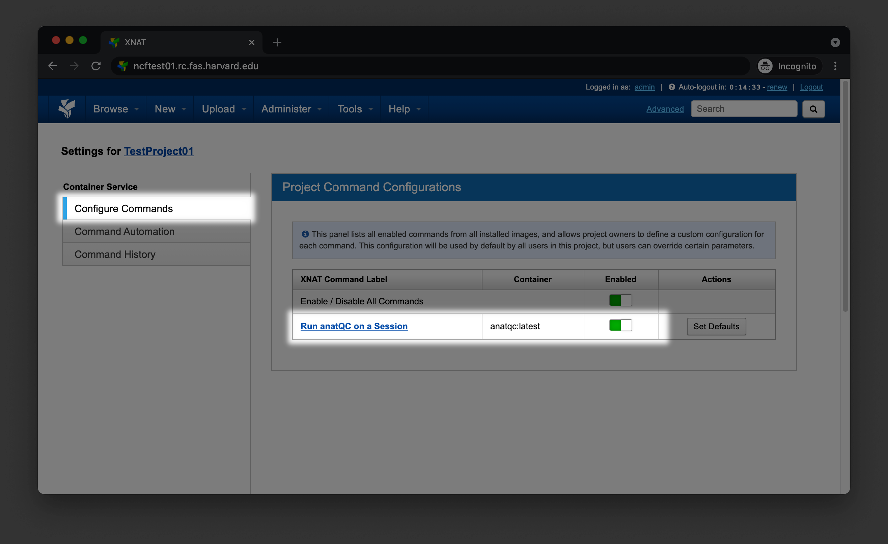

Developer documentation
=======================
.. _XNAT: https://xnat.org
.. _command.json: https://github.com/harvard-nrg/anatqc/blob/xnat-1.7.6/command.json
.. _T1w: https://tinyurl.com/hhru8ytz
.. _vNav: https://www.ncbi.nlm.nih.gov/pmc/articles/PMC3320676/
.. _Gradle: https://gradle.org/install/

Installation
------------
At the moment, the only supported way to install AnatQC is `within a container <#building-a-container>`_.

downloading a container
^^^^^^^^^^^^^^^^^^^^^^^
There are prebuilt versions of AnatQC on `Docker Hub <https://hub.docker.com/repository/docker/neuroinformatics/anatqc>`_. You can pull the latest version by running ::

    docker pull neuroinformatics/anatqc

or you can pull a specific version e.g., ``0.4.0`` by running ::

    docker pull neuroinformatics/anatqc:0.4.0
    
building a container
^^^^^^^^^^^^^^^^^^^^
To build AnatQC as a container, grab the latest `Dockerfile <https://github.com/harvard-nrg/anatqc/blob/main/Dockerfile>`_ from the repository and run ::

    docker build -t anatqc:latest - < Dockerfile

Now you can run ``anatQC.py`` using ``docker run`` ::

    docker run anatqc:latest --help

XNAT Installation
-----------------
The following section will describe how to build and configure AnatQC as a `XNAT`_ plugin.

building the plugin
^^^^^^^^^^^^^^^^^^^
Clone the ``xnat-1.7.6`` branch from the ``github.com/harvard-nrg/anatqc`` 
repository ::

    git clone -b xnat-1.7.6 --single-branch https://github.com/harvard-nrg/anatqc

Change into the repository directory and compile the plugin using `Gradle`_ ::

    ./gradlew jar

Once the plugin has been compiled, move the resulting ``.jar`` into your XNAT plugins directory ::

    mv ./build/libs/anatqc-plugin-1.0.0.jar ${XNAT_HOME}/plugins/

setting up the container
^^^^^^^^^^^^^^^^^^^^^^^^
.. note::
   This documentation assumes you have successfully `built the container <#building-the-container>`_ and that the container is being served from a local Docker daemon e.g., ``unix:///var/run/docker.sock`` on your XNAT server.

To setup the container within XNAT, go to ``Administer > Plugin Settings > Images & Commands``, find the AnatQC container, and click ``Add New Command``

You should see a small dialog box where you can configure your command. Paste the content from `command.json`_.

Navigate to your Project's home page and click on ``Project Settings`` in the ``Actions`` box. Select ``Configure Commands`` and enable the new command for your project

