XNAT user documentation
=======================
.. _XNAT: https://doi.org/10.1385/NI:5:1:11
.. _command.json: https://github.com/harvard-nrg/anatqc/blob/xnat-1.7.6/command.json
.. _T1w: https://tinyurl.com/hhru8ytz
.. _vNav: https://doi.org/10.1002/mrm.23228
.. _FreeSurfer: https://doi.org/10.1016/j.neuroimage.2012.01.021
.. _FreeSurfer license: https://surfer.nmr.mgh.harvard.edu/registration.html
.. _MRIQC: https://doi.org/10.1371/journal.pone.0184661
.. _SNR Tot: https://mriqc.readthedocs.io/en/latest/iqms/t1w.html
.. _Image Quality Metrics: https://mriqc.readthedocs.io/en/latest/iqms/t1w.html
.. _EFC: https://mriqc.readthedocs.io/en/latest/iqms/t1w.html
.. _FWHM Avg: https://mriqc.readthedocs.io/en/latest/iqms/t1w.html
.. _GM SNR: https://mriqc.readthedocs.io/en/latest/iqms/t1w.html
.. _Euler Holes: https://surfer.nmr.mgh.harvard.edu/fswiki/mris_euler_number
.. _Entropy Focus Criterion: http://dx.doi.org/10.1109/42.650886

Tagging your scans
------------------
For AnatQC to discover `T1w`_ and `vNav`_ scans to process, you need to add notes to those scans in `XNAT`_. You can add notes using the ``Edit`` button located within the ``Actions`` box on the MR Session report page

========= ============================ ==================================================
Type      Example series               Note
========= ============================ ==================================================
`T1w`_    ``ABCD_T1w_MPR_vNav``        ``#T1w_001, #T1w_002, ..., #T1w_N``
`vNav`_   ``ABCD_T1w_MPR_vNav_setter`` ``#T1w_move_001, #T1w_move_002, ..., #T1w_move_N``
========= ============================ ==================================================

The image below displays an MR Session report page with populated notes

.. note::
   Note that if a ``T1w`` scan has a corresponding ``vNav`` scan, they should be assigned matching numbers. For example, ``#T1w_move_001`` would correspond to ``#T1w_001``.

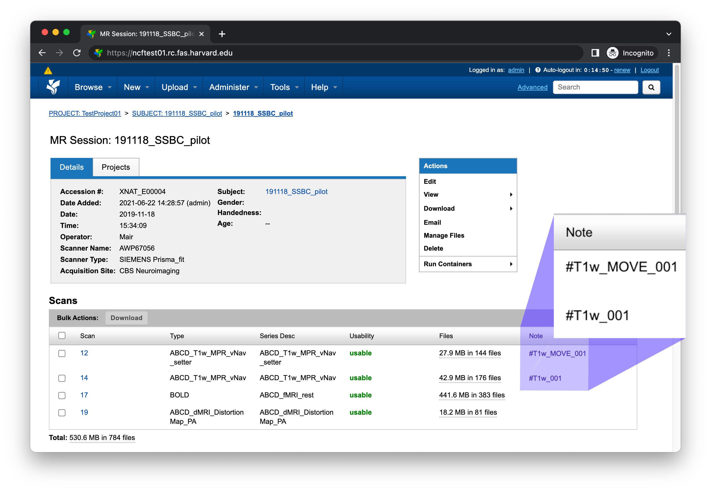

Running the pipeline
--------------------
To run the AnatQC pipeline, use the ``Run Containers > anatqc-session`` button located within the ``Actions`` box on the MR Session report page

.. note::
   If you don't see the ``Run Containers`` menu, please refer to `Setting up the container <developers.html#setting-up-the-container>`_.

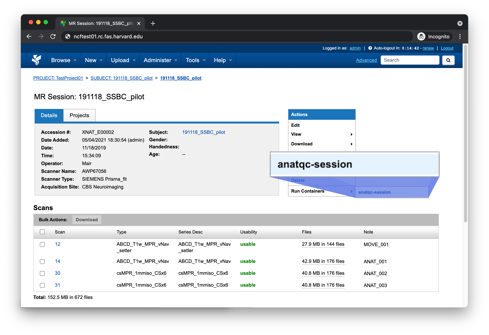

This should bring up a small form with several configurable settings. Continue reading for a description of each setting

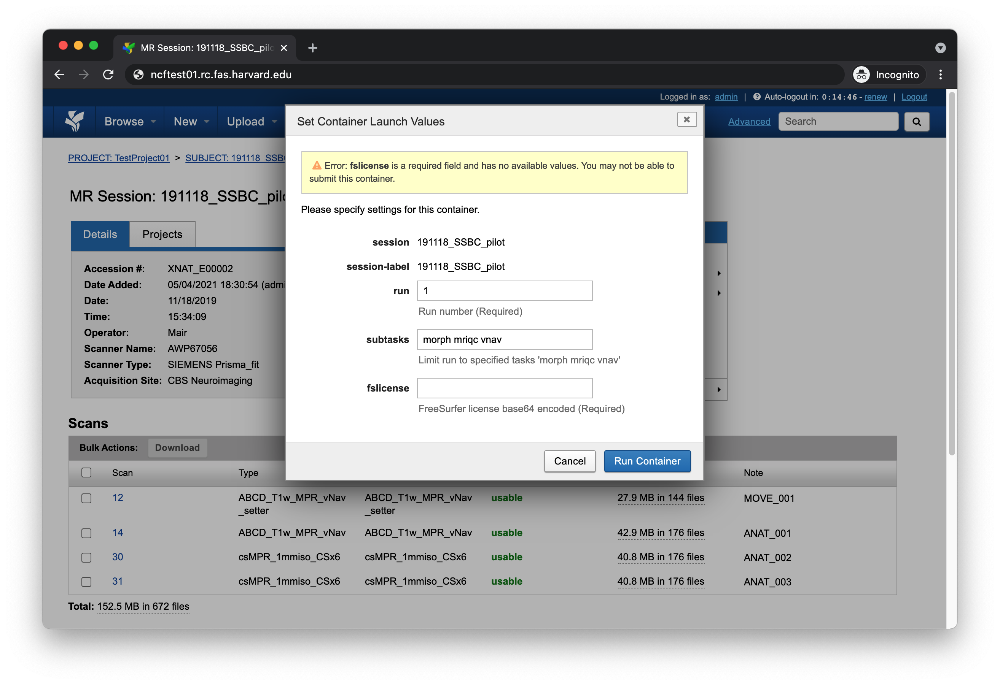

run
^^^
This should be set to the integer value of the scan you want to process. If there's a corresponding ``move`` scan, that scan will also be processed

============== =======
T1w scan       run
============== =======
``#T1w_001``   1
``#T1w_002``   2
``#T1w_999``   999
============== =======

subtasks
^^^^^^^^
Under most circumstances you'll want to leave this field set to its default value ::

    morph mriqc vnav

fslicense
^^^^^^^^^
This field should be set to a base64 encoded `FreeSurfer license`_. If you have a license file on a Linux or macOS machine, you can use the ``openssl`` command ::

    openssl base64 < license.txt

or you can use the ``base64`` command, if that utility is installed :: 

    base64 license.txt

Understanding the report page
-----------------------------
The following section will break down each section of the AnatQC report page.

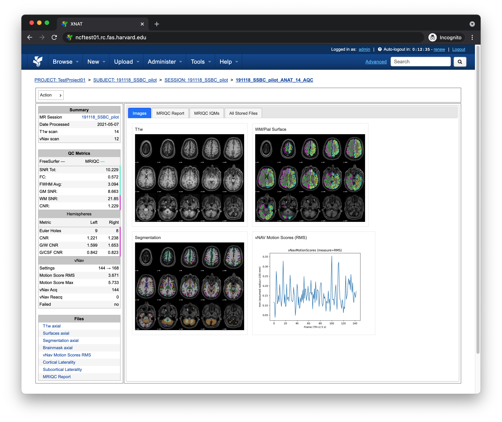

Left pane
^^^^^^^^^
The left pane is broken up into several distinct sections. Each section will be described below.

Summary
"""""""
The ``Summary`` pane orients the user to what MR Session they're currently looking at and various processing details

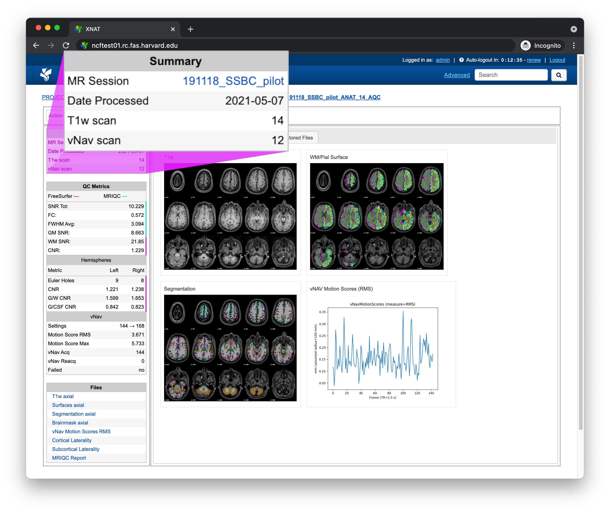

============== ==================================
Key            Description
============== ==================================
MR Session     MR Session label
Date Processed Processing date
T1w scan       T1-weighted scan used
vNav scan      vNav setter scan used (if present)
============== ==================================

QC Metrics
""""""""""
The ``QC Metrics`` pane displays quality control metrics computed *over the entire volume*

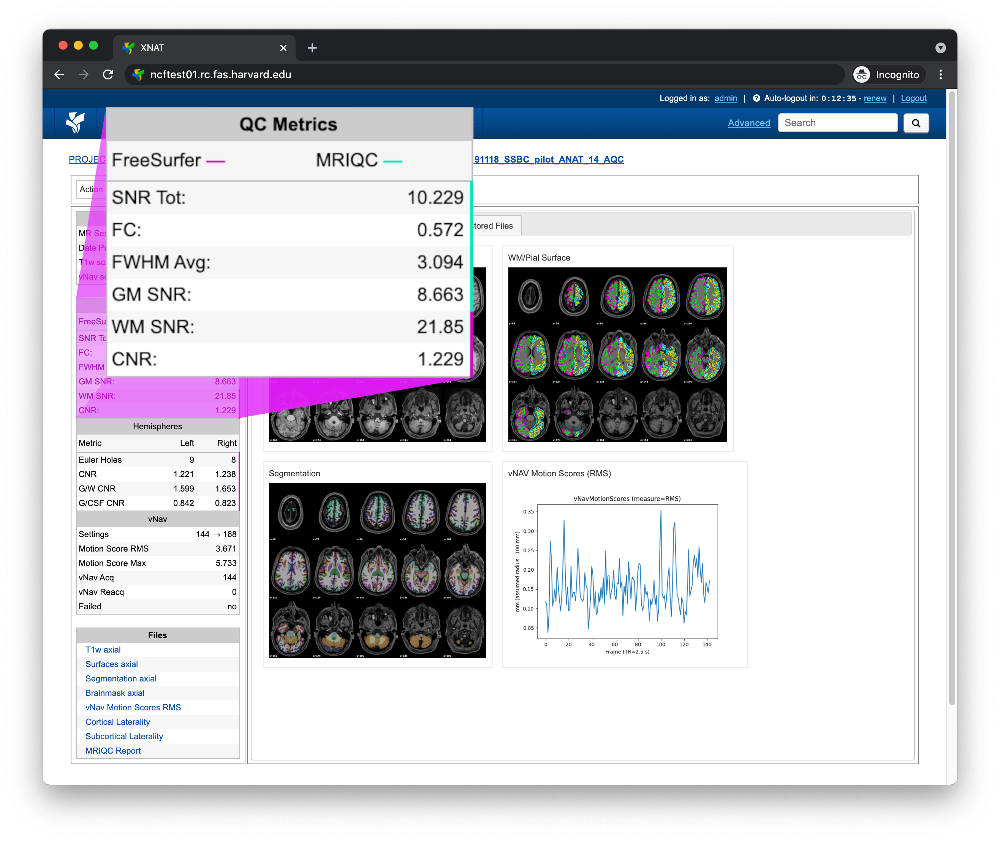

=========== ============= =================================================
Metric      From          Description                              
=========== ============= =================================================
`SNR Tot`_  `MRIQC`_      Signal-to-noise ratio
`EFC`_      `MRIQC`_      `Entropy Focus Criterion`_
`FWHM Avg`_ `MRIQC`_      FWHM of spatial distribution of voxel intensities
`GM SNR`_   `MRIQC`_      Gray matter signal-to-noise ratio
WM SNR      `FreeSurfer`_ White matter signal-to-noise ratio
CNR         `FreeSurfer`_ Contrast-to-noise ratio
=========== ============= =================================================

Hemispheres
"""""""""""
The ``Hemispheres`` pane displays quality control metrics computed *over each hemisphere*

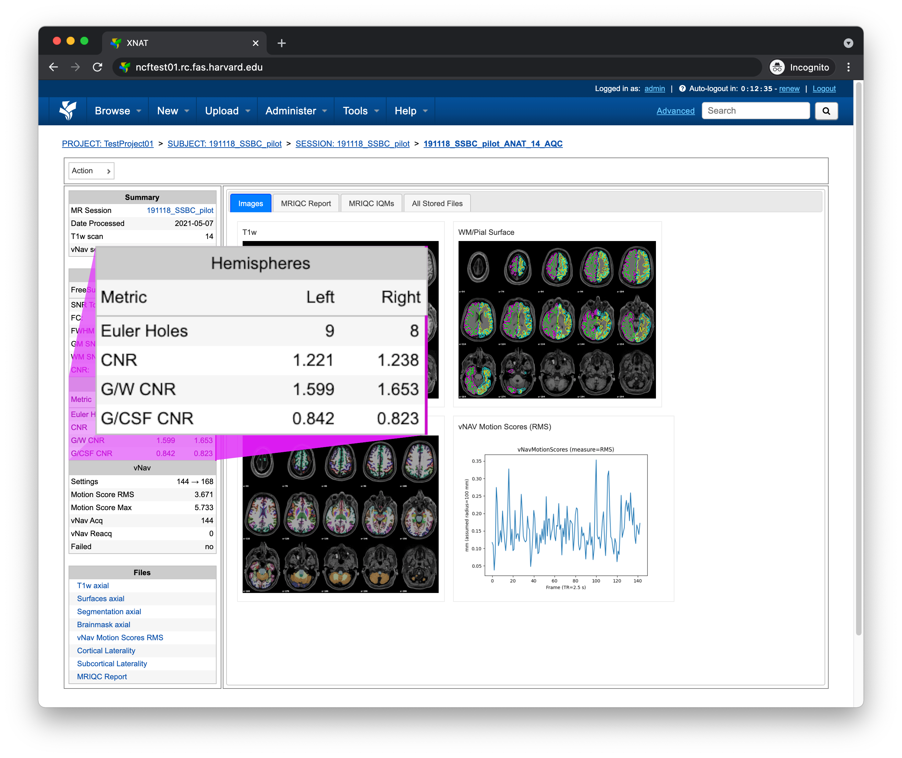

============== ============= ===========================================================
Metric         From          Description
============== ============= ===========================================================
`Euler Holes`_ `FreeSurfer`_ Estimate of the number of surface defects
CNR            `FreeSurfer`_ Global contrast-to-noise ratio
G/W CNR        `FreeSurfer`_ Gray and white matter contrast-to-noise ratio
G/CSF CNR      `FreeSurfer`_ Gray matter and cerebrospinal fluid contrast-to-noise ratio
============== ============= ===========================================================

vNav
""""
The ``vNav`` pane displays vNav specific quality control metrics, but *only* if a vNav scan was processed

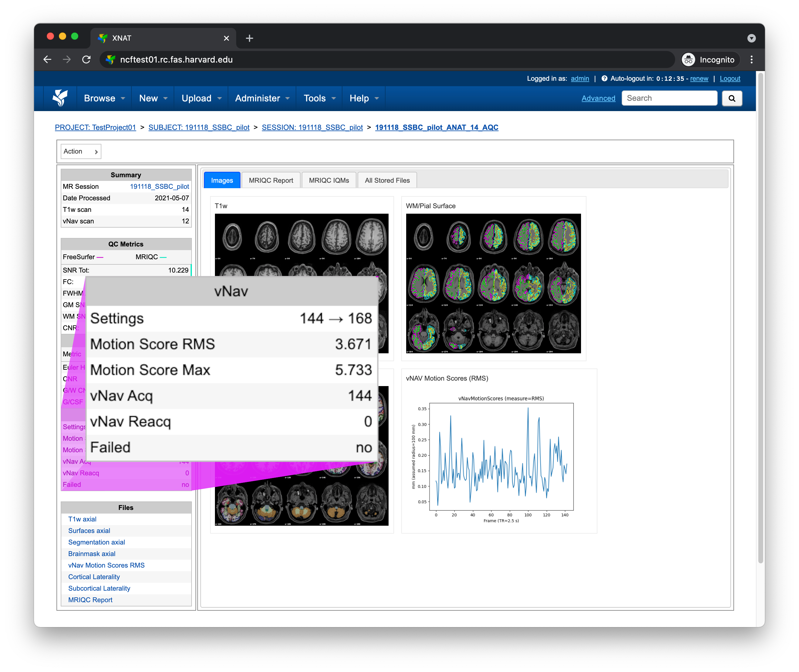

================ ==================================================
Metric           Description
================ ==================================================
Settings         Minimum and maximum number of navigators allowed
Motion Score RMS Root mean square of motion scores
Motion Score Max Maximum motion score
vNav Acq         Total number of navigators collected
Failed           vNav failure detected
================ ==================================================

Files
"""""
The ``Files`` pane contains the most commonly requested files. Clicking on any of these files will display that file in the browser

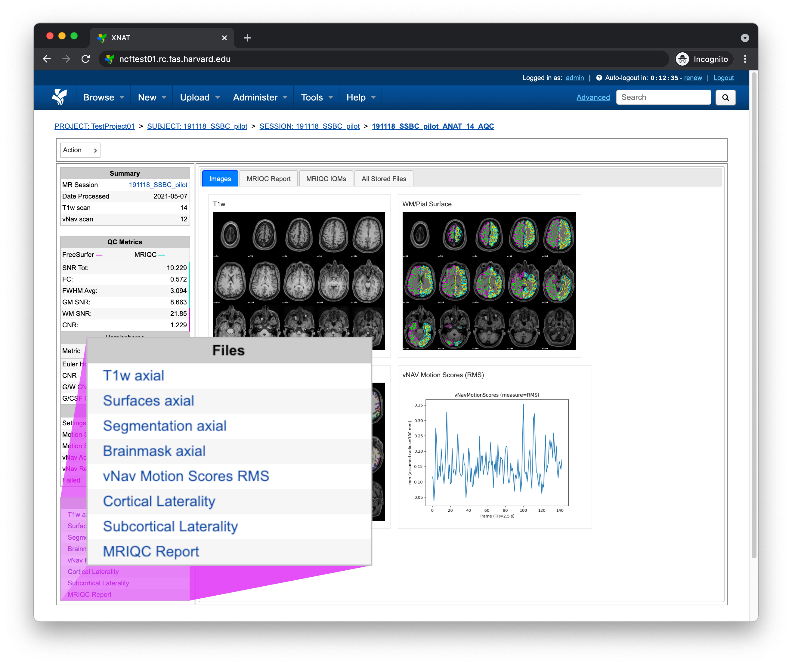

======================= =================================================
File                    Description
======================= =================================================
T1w axial               T1-weighted image, axial plane
Surfaces axial          `FreeSurfer`_ surface boundaries, axial plane
Segmentation axial      `FreeSurfer`_ segmentations, axial plane
Brainmask axial         `FreeSurfer`_ brain mask, axial plane
vNav Motion Scores RMS  vNav motion scores RMS plot
Cortical Laterality     Cortical region volume laterality plot
Subcortical Laterality  Subcortical region volume laterality plot
`MRIQC`_ Report         `MRIQC`_ HTML report
======================= =================================================

Tabs
^^^^
To the right of the `left pane <#left-pane>`_ you'll find a tab container. The following section explains the contents of each tab.

Images
""""""
The ``Images`` tab displays a zoomed out view of the T1-weighted image, `FreeSurfer`_ surface boundaries, `FreeSurfer`_ segmentations, and vNav RMS motion scores

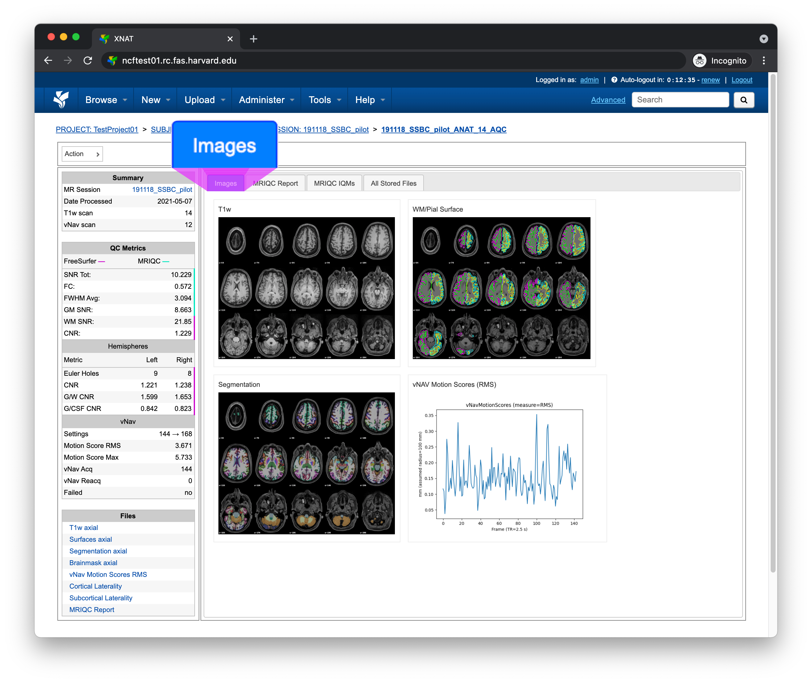

Clicking on an image within the ``Images`` tab will display a larger version of that image in the browser

.. note:: 
   AnatQC automatically crops and centers each brain slice for improved visibility. For this reason, slices will often appear larger than their native size.

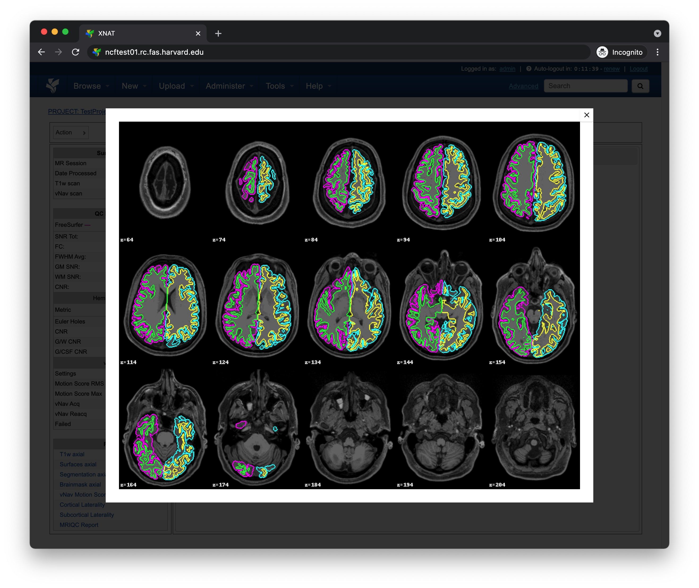

MRIQC Report tab
""""""""""""""""
The ``MRIQC Report`` tab displays the complete MRIQC HTML report

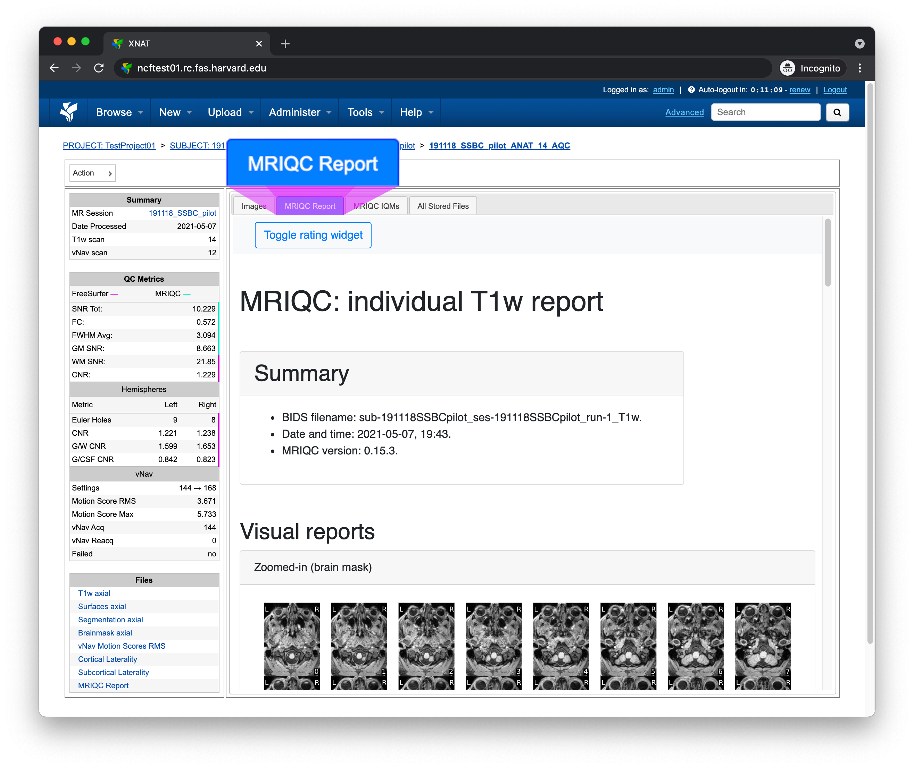

MRIQC IQMs
""""""""""
The ``MRIQC IQMs`` tab displays all of the MRIQC `Image Quality Metrics`_. 
These metrics can also be found within the MRIQC HTML Report

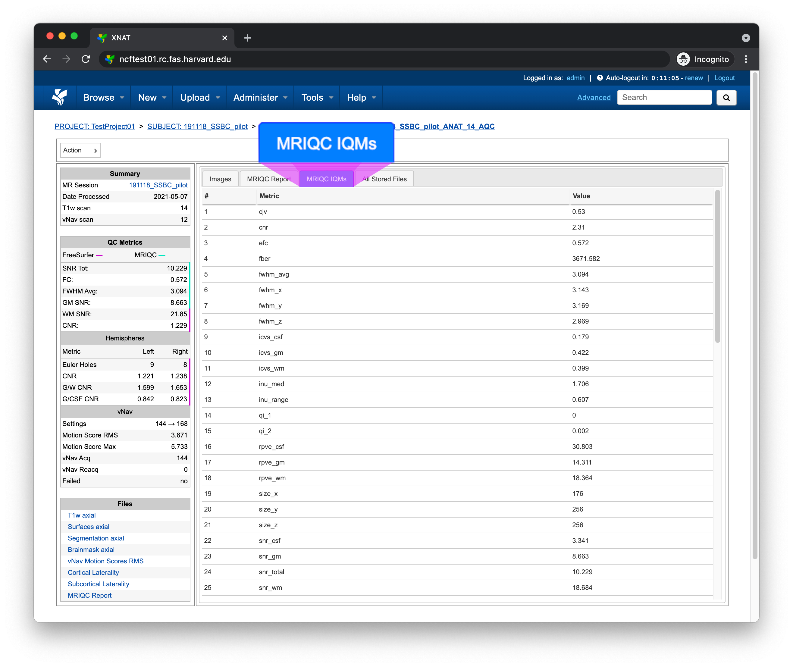

All Stored Files
""""""""""""""""
The ``All Stored Files`` tab contains a list of *every file* stored by AnatQC

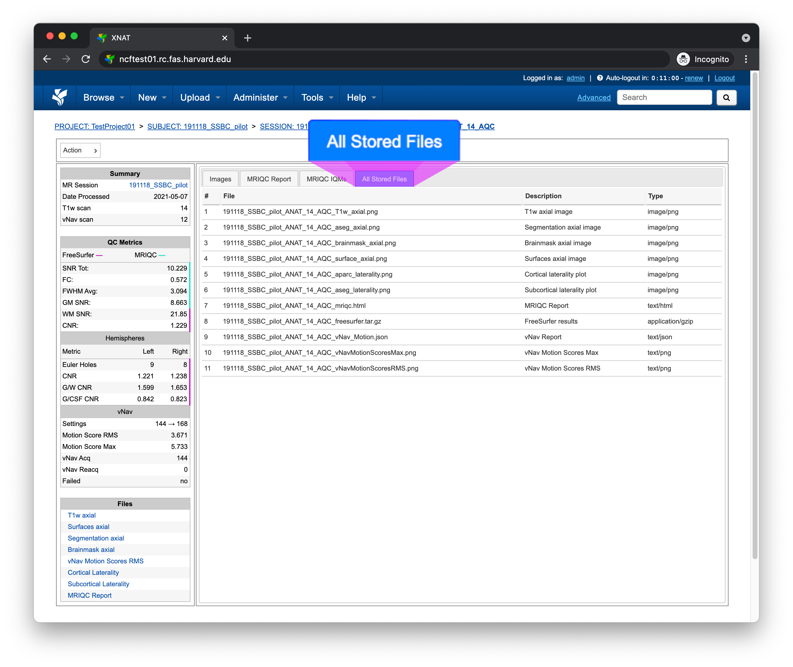

.. note::
   Clicking on a file within the ``All Stored Files`` tab will download that file.

================================= ==========================================
File                              Description
================================= ==========================================
``*_AQC_T1w_axial.png``           T1-weighted image, axial plane
``*_AQC_aseg_axial.png``          FreeSurfer segmentations, axial plane
``*_AQC_brainmask_axial.png``     FreeSurfer brain mask image, axial plane
``*_AQC_surface_axial.png``       FreeSurfer surface boundaries, axial plane
``*_AQC_aparc_laterality.png``    FreeSurfer parcellation laterality plot
``*_AQC_aseg_laterality.png``     FreeSurfer segmentation laterality plot
``*_AQC_mriqc.html``              MRIQC HTML report
``*_AQC_freesurfer.tar.gz``       FreeSurfer results
``*_AQC_vNav_Motion.json``        vNav processing output
``*_AQC_vNavMotionScoresMax.png`` vNav motion max plot
``*_AQC_vNavMotionScoresRMS.png`` vNav motion RMS plot
================================= ==========================================
