# Users Guide

## Running AnatQC
While you are welcome to install AnatQC and all of its dependencies manually, 
using one of the [prebuilt containers][Container download] is the most reliable 
way to run AnatQC. The remainder of this section will assume that you are 
running AnatQC using an [Apptainer/Singularity][Apptainer] container.

### Modes
AnatQC is broken up into three modes: [get][], [process][], and [tandem][].

#### get
If you have followed the [Tagging your scans][] section, the `get` mode can be 
used to automatically download your [T1w][] and optional [vNav][] scans from 
your [XNAT][] installation, and seamlessly convert them to [BIDS][]

```bash
singularity run -c --pwd /sw/apps/anatqc anatqc.sif \
    tandem \
    --xnat-alias ${XNAT}
    --label ${XNAT_SESSION_LABEL}
    --run ${RUN}
    --bids-dir ${BIDS_DIR}
```

#### process
The `process` mode will run AnatQC on a specific [T1w][] and optional [vNav][]
scan from a [BIDS][] directory. You are only responsible for leading AnatQC to 
your data by supplying the [BIDS][] root directory `--bids-dir`, subject `--sub`, 
session `--ses`, and run `--run`

!!! note "XNAT upload is optional"
    If you are not interested in uploading the final results to your [XNAT][] 
    installation, you may omit the `--xnat-alias` and `--xnat-upload` 
    arguments.

```bash
singularity run -c --pwd /sw/apps/t2qc anatqc.sif \
    process \
    --sub ${BIDS_SUBJECT} \
    --ses ${BIDS_SESSION} \
    --run ${BIDS_RUN} \
    --bids-dir ${BIDS_DIR} \ 
    --xnat-alias ${XNAT} \
    --xnat-upload
```

#### tandem
The `tandem` mode simply runs the [get][] and [process][] modes in tandem

!!! note "XNAT upload is optional"
    If you are not interested in uploading the final results to your [XNAT][] 
    installation, you may omit the `--xnat-alias` and `--xnat-upload` 
    arguments.


```bash
singularity run -c --pwd /sw/apps/anatqc anatqc.sif \
    tandem \
    --xnat-alias ${XNAT}
    --label ${XNAT_SESSION_LABEL}
    --run ${RUN}
    --bids-dir ${BIDS_DIR}
    --xnat-upload
```

## XNAT Integration
### Tagging your scans
The [get][] mode of AnatQC is able to pull your data down from an [XNAT][] 
installation and convert the data directly to [BIDS][]. For this to work, AnatQC 
must have a way to automatically find your [T1w][] and optional [vNav][] scans.

To identify your [T1w][] and [vNav][] scans, you must enter special *tags* into
the note fields for those scans within [XNAT][]. You can add notes using the 
`Edit` button located within the `Actions` box on the MR Session report screen, 
or automate this using the [XNAT Scans API][]. The screenshot below shows a MR 
Session report page with populated notes

!!! note "Linking a `T1w` to its corresponding `vNav`"
    While it is often the case that a `vNav` scan is exactly one or two scans 
    before its corresponding `T1w` scan, it feels wrong to hardcode that 
    assumption into AnatQC. For that reason, you are responsible for linking 
    your `T1w` scan to its corresponding `vNav` by assigning matching run 
    numbers when you are entering the tags. For example, a `vNav` scan with 
    the tag `#T1w_MOVE_001` would correspond to the `T1w` scan with the tag
    `#T1w_001`.

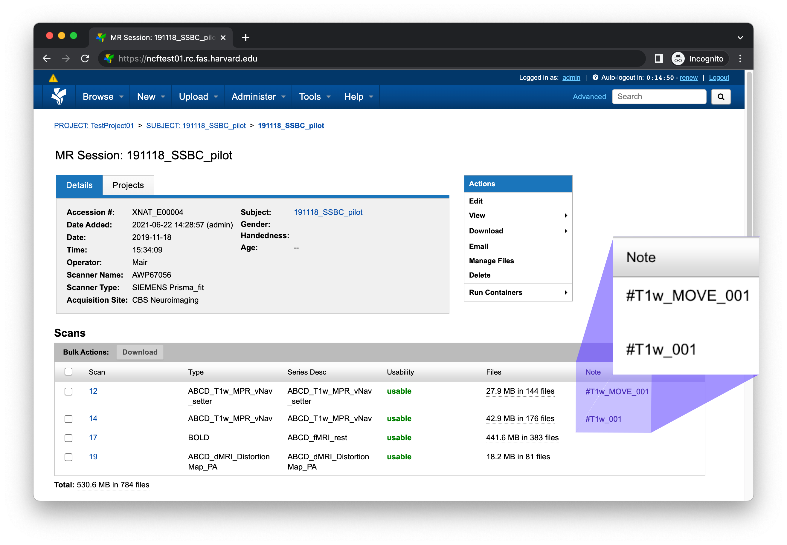

Below are more examples of MRI series descriptions and their corresponding notes
 
| Scan Type   | Series Description         | Note                                             |
|-------------|----------------------------|--------------------------------------------------|
| `T1w`       | `ABCD_T1w_MPR_vNav`        | `#T1w_001, #T1w_002, ..., #T1w_N`                |
| `vNav`      | `ABCD_T1w_MPR_vNav_setter` | `#T1w_MOVE_001, #T1w_MOVE_002, ..., #T1w_MOVE_N` |

### Running the pipeline
To launch the AnatQC pipeline from within XNAT, you should use the 
`Run Containers > anatqc-session` button located within the `Actions` box on 
the MR Session report page

!!! question "I don't see the `Run Containers` menu"
    If you don’t see the Run Containers menu, please refer to 
    [Setting up the container][].

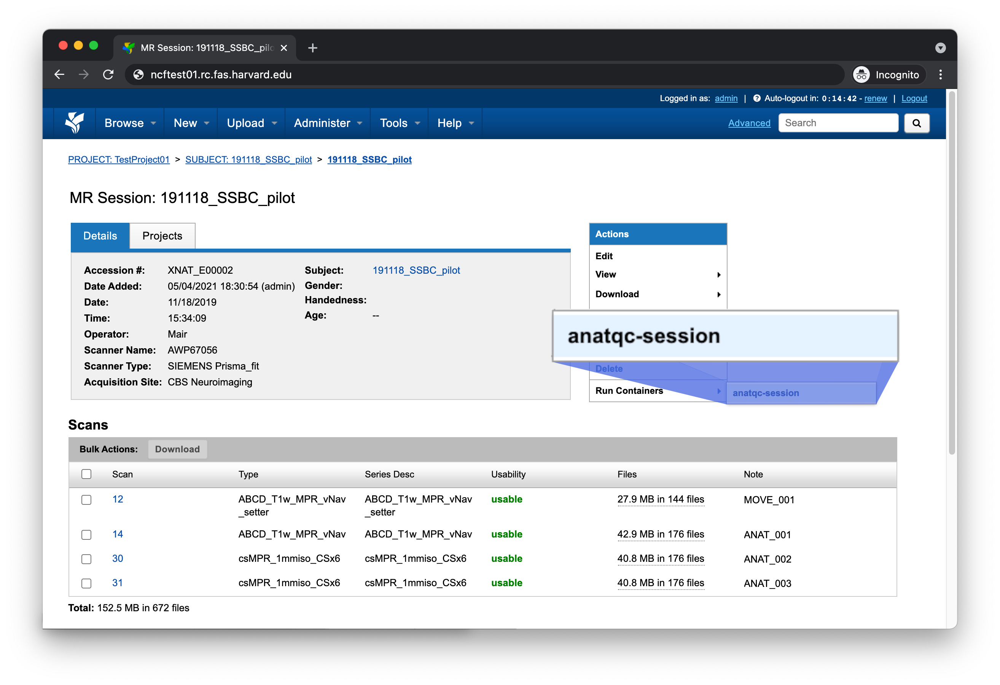

This should bring up a small dialog with several configurable options. You will 
find an overview of each setting under [Container launch settings][] below.

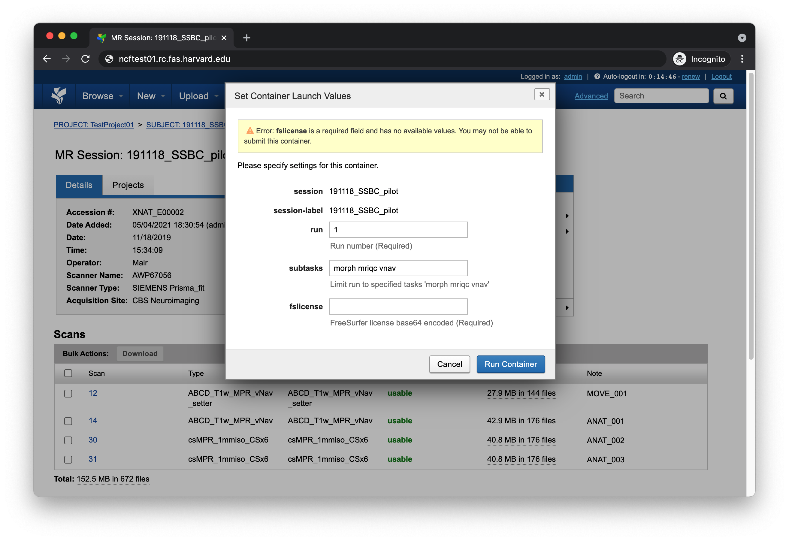

#### Container launch settings
##### run
This should be set to the integer value of the scan you wish to process. If
there's a corresponding `MOVE` scan, that scan will also be processed

| T1w scan   | run |
|------------|-----|
| `#T1w_001` | 1   |
| `#T1w_002` | 2   |
| `#T1w_999` | 999 |

##### subtasks
You can use `subtasks` to enable and disable various processing stages of 
AnatQC. Under most circumstances, you will want to leave this field set to its
default

```text
morph mriqc vnav
```

##### fslicense
The `fslicense` field should be populated with the base64-encoded contents of 
your [FreeSurfer license][] file. If your license file is on a Linux or macOS 
machine, you can use the `openssl` command to encode the contents

```bash
openssl base64 < license.txt
```

You can also use the `base64` command, if that command happens to be installed

```bash
base64 license.txt
```

### Understanding the report page
The following section will break down each section of the AnatQC report page.

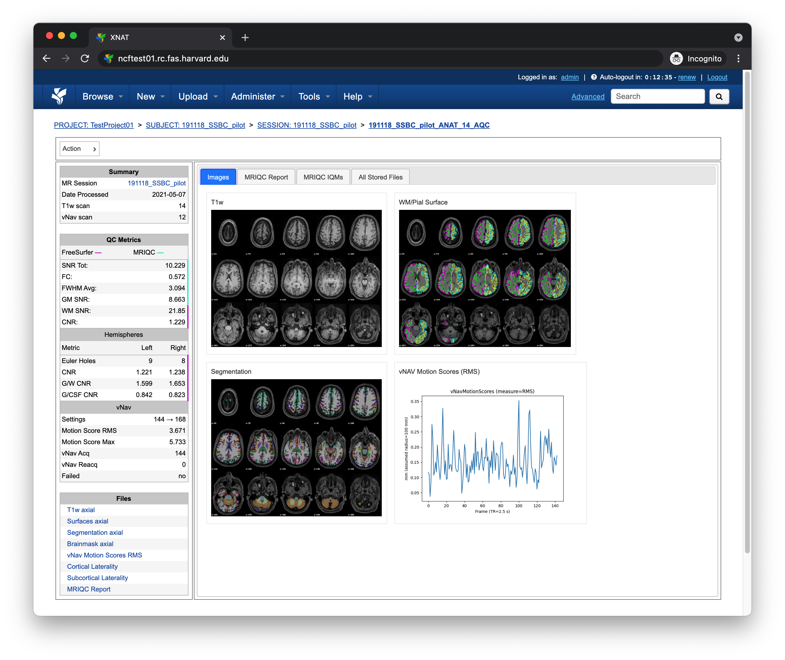

#### Left pane
The left pane is broken up into several sections. Each section will be described
below.

##### Summary
The `Summary` section orients the user to the MR Session they're currently 
looking at, in addition to various processing details

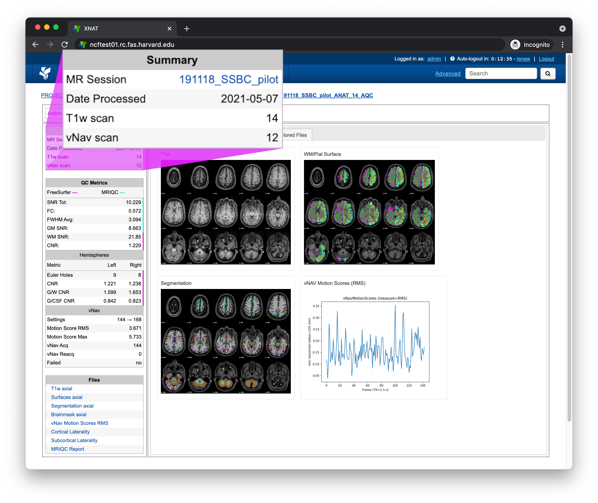

| Key            | Description           | 
|----------------|-----------------------|
| MR Session     | MR Session label      |
| Date Processed | Processing date       |
| T1w scan       | T1-weighted scan used |
| vNav scan      | vNav setter scan used | 

##### QC Metrics
The `QC Metrics` section displays important quality control metrics computed 
*over the entire volume*

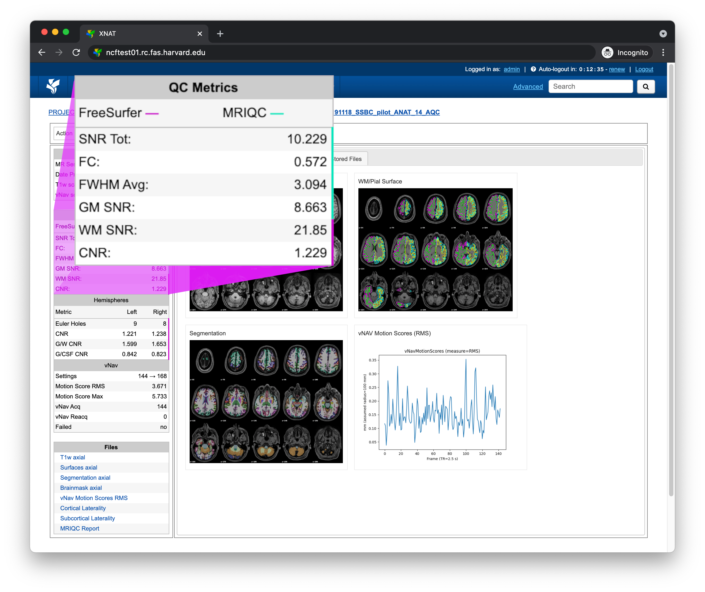

| Metric       | From           | Description                                       |
|--------------|----------------|---------------------------------------------------|
| [SNR Tot][]  | [MRIQC][]      | Signal-to-noise ratio                             |   
| [EFC][]      | [MRIQC][]      | [Entropy Focus Criterion][]                       |
| [FWHM Avg][] | [MRIQC][]      | FWHM of spatial distribution of voxel intensities |
| [GM SNR][]   | [MRIQC][]      | Gray matter signal-to-noise ratio                 |
| WM SNR       | [FreeSurfer][] | White matter signal-to-noise ratio                |
| CNR          | [FreeSurfer][] | Contrast-to-noise ratio                           |

##### Hemispheres
The `Hemispheres` section displays quality control metrics computed 
*over each hemisphere*

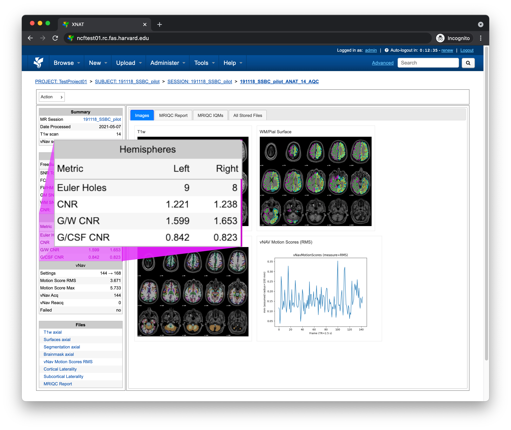

| Metric          | From           | Description                                                 | 
|-----------------|----------------|-------------------------------------------------------------|
| [Euler Holes][] | [FreeSurfer][] | Estimate of the number of surface defects                   |
| CNR             | [FreeSurfer][] | Global contrast-to-noise ratio                              |
| G/W CNR         | [FreeSurfer][] | Gray and white matter contrast-to-noise ratio               |
| G/CSF CNR       | [FreeSurfer][] | Gray matter and cerebrospinal fluid contrast-to-noise ratio |

##### vNav
The `vNav` section displays vNav-specific quality control metrics. This section
will only appear if a vNav scan was detected and processed

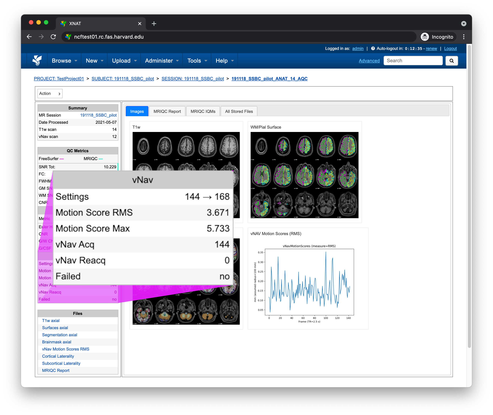

| Metric           | Description                                                         |
|------------------|---------------------------------------------------------------------|
| Settings         | Minimum and maximum number of navigators configured by the protocol |
| Motion Score RMS | Root mean square of motion scores                                   |
| Motion Score Max | Maximum motion score                                                |
| vNav Acq         | Total number of navigators collected                                |
| Failed           | `yes` or `no` if a vNav failure was detected                        |

##### Files
The `Files` section contains the most commonly requested files. Clicking on any 
of these files will display the file in the browser

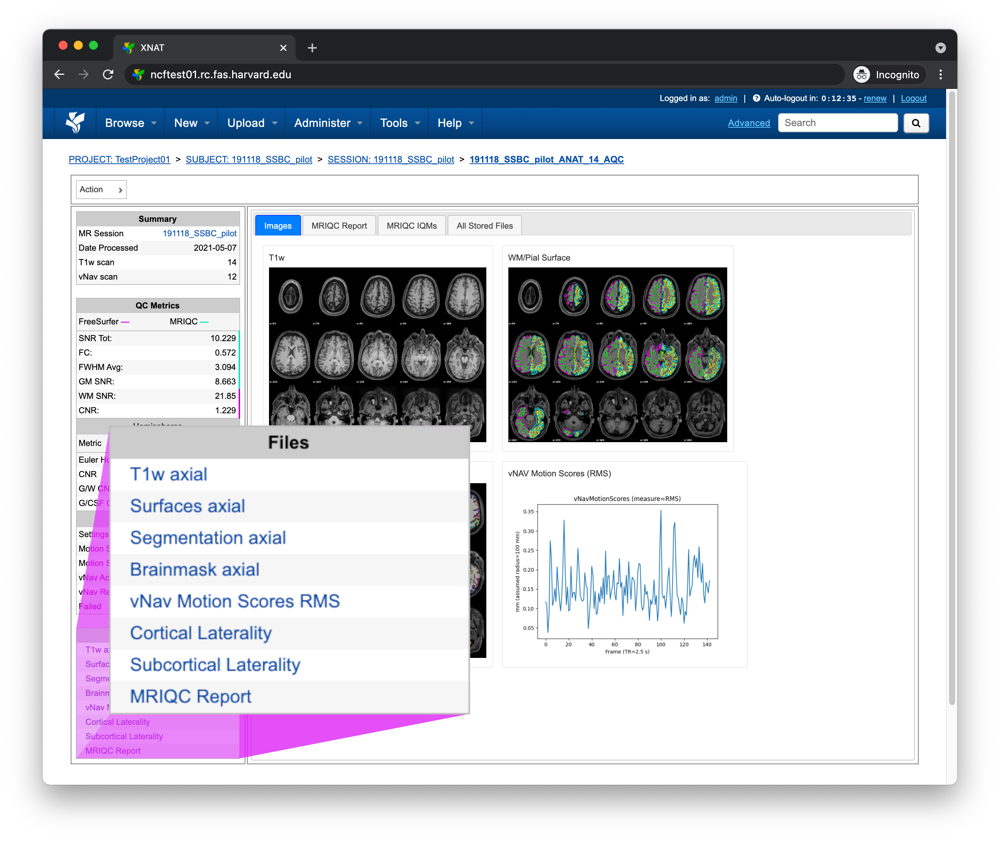

| File                   | Description                                    |
|------------------------|------------------------------------------------|
| T1w axial              | T1-weighted image, axial plane                 |
| Surfaces axial         | [FreeSurfer][] surface boundaries, axial plane |
| Segmentation axial     | [FreeSurfer][] segmentations, axial plane      |
| Brainmask axial        | [FreeSurfer][] brain mask, axial plane         |
| vNav Motion Scores RMS | vNav motion scores RMS plot                    |
| Cortical Laterality    | Cortical region volume laterality plot         |
| Subcortical Laterality | Subcortical region volume laterality plot      |
| [MRIQC][] Report       | [MRIQC][] HTML report                          |

#### Tabs
To the right of the left pane, you'll find a tabbed container. The following 
section explains the contents of each tab.

##### Images
The `Images` tab displays mosaic views of the T1-weighted image,
[FreeSurfer][] surface boundaries, [FreeSurfer][] segmentations, and 
a plot of the vNav RMS motion scores

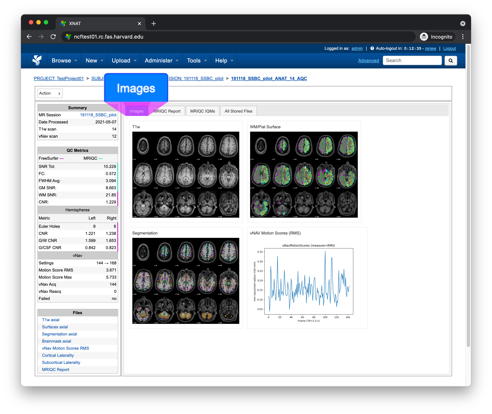

Clicking on any image within the `Images` tab should display a larger version of 
the image within the browser.

!!! question "How are these images created?"
    AnatQC automatically crops and centers each brain slice for improved 
    visibility. For this reason, some slices will often appear larger than 
    their actual size.

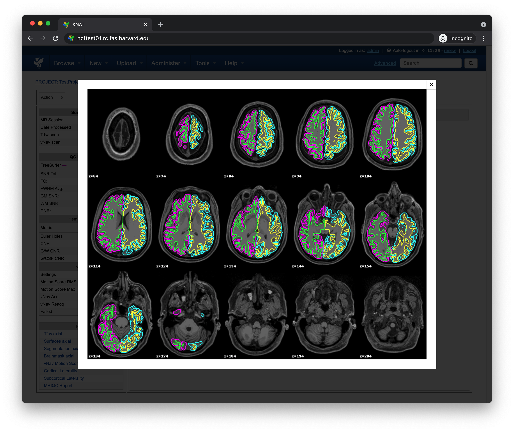

##### MRIQC Report tab
The `MRIQC Report` tab displays the full downstream MRIQC HTML report

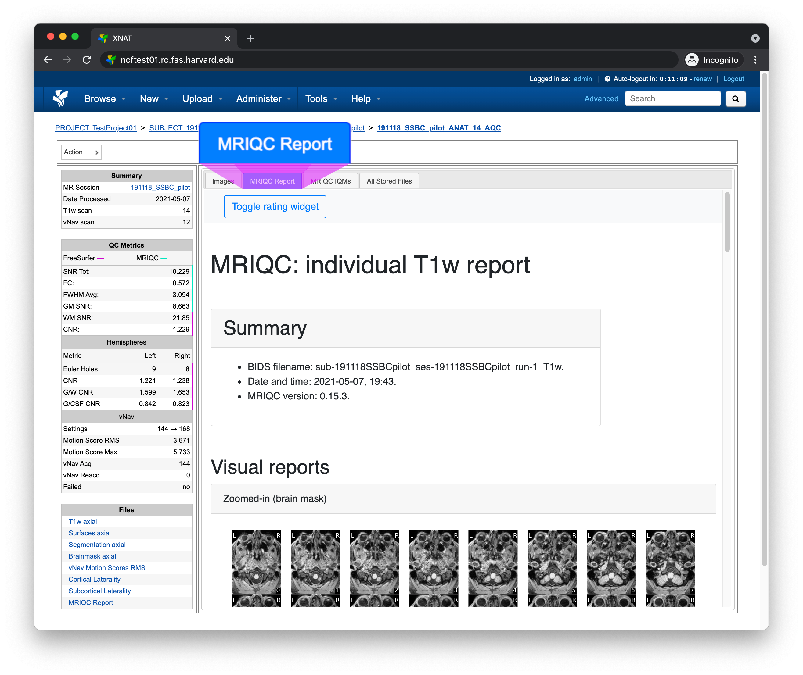

##### MRIQC IQMs
The `MRIQC IQMs` tab displays all of the MRIQC [Image Quality Metrics][] in a
convenient tabular format. These metrics can also be found within the MRIQC HTML 
Report

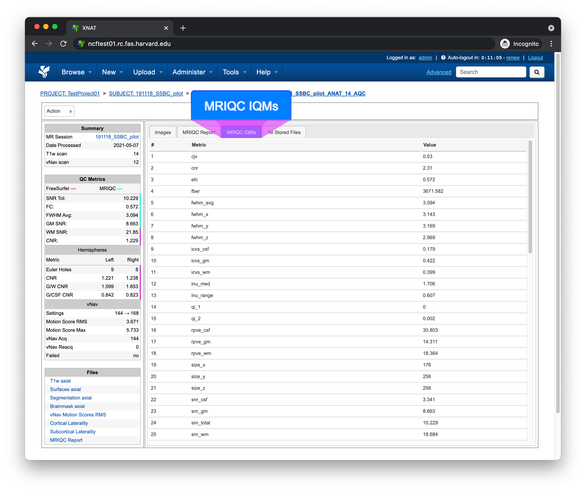

##### All Stored Files
The `All Stored Files` tab contains a list of every file stored by AnatQC.
Clicking on any of these files will download the file

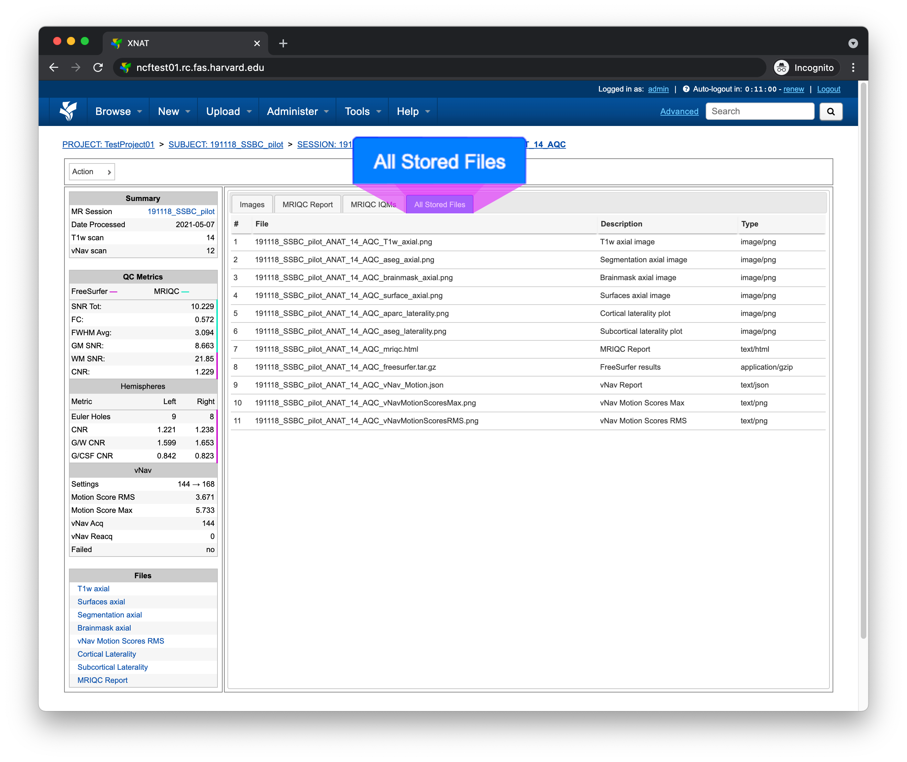

| File                            | Description                                |
|---------------------------------|--------------------------------------------|
| `*_AQC_T1w_axial.png`           | T1-weighted image, axial plane             |
| `*_AQC_aseg_axial.png`          | FreeSurfer segmentations, axial plane      |
| `*_AQC_brainmask_axial.png`     | FreeSurfer brain mask image, axial plane   |                    
| `*_AQC_surface_axial.png`       | FreeSurfer surface boundaries, axial plane |
| `*_AQC_aparc_laterality.png`    | FreeSurfer parcellation laterality plot    |
| `*_AQC_aseg_laterality.png`     | FreeSurfer segmentation laterality plot    |
| `*_AQC_mriqc.html`              | MRIQC HTML report                          |
| `*_AQC_freesurfer.tar.gz`       | FreeSurfer results                         |
| `*_AQC_vNav_Motion.json`        | vNav processing output                     |
| `*_AQC_vNavMotionScoresMax.png` | vNav motion max plot                       |
| `*_AQC_vNavMotionScoresRMS.png` | vNav motion RMS plot                       |


[T1w]: https://tinyurl.com/hhru8ytz
[vNav]: https://doi.org/10.1002/mrm.23228
[XNAT]: https://doi.org/10.1385/NI:5:1:11
[Setting up the container]: ../admin/#setting-up-the-container
[FreeSurfer]: https://doi.org/10.1016/j.neuroimage.2012.01.021
[FreeSurfer license]: https://surfer.nmr.mgh.harvard.edu/registration.html
[MRIQC]: https://doi.org/10.1371/journal.pone.0184661
[SNR Tot]: https://mriqc.readthedocs.io/en/latest/iqms/t1w.html
[EFC]: https://mriqc.readthedocs.io/en/latest/iqms/t1w.html
[Entropy Focus Criterion]: http://dx.doi.org/10.1109/42.650886
[FWHM Avg]: https://mriqc.readthedocs.io/en/latest/iqms/t1w.html
[GM SNR]: https://mriqc.readthedocs.io/en/latest/iqms/t1w.html
[Euler Holes]: https://surfer.nmr.mgh.harvard.edu/fswiki/mris_euler_number
[Image Quality Metrics]: https://mriqc.readthedocs.io/en/latest/iqms/t1w.html
[Container launch settings]: #container-launch-settings
[BIDS]: https://bids-specification.readthedocs.io/en/stable/
[XNAT Scans API]: https://wiki.xnat.org/xnat-api/image-session-scans-api
[Apptainer]: https://apptainer.org/
[Tagging your scans]: #tagging-your-scans
[Container download]: ../admin#downloading-the-container
[get]: #get
[process]: #process
[tandem]: #tandem
